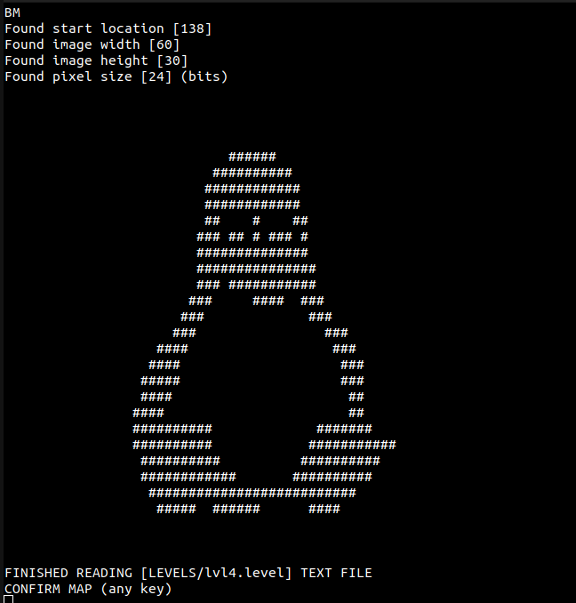
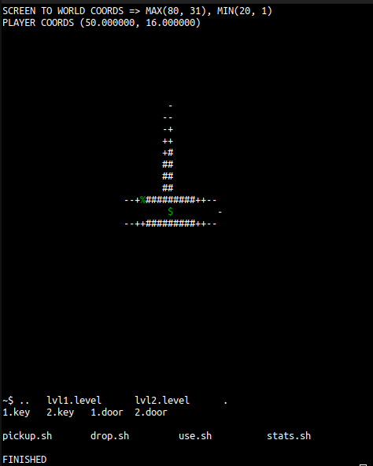

# LARK_Game
L.A.R.K Game for Intro To Unix

11/3/2022
  Fixed teeny weeny bugs

10/25/2022
  (NOTE TO SELF : Remember to ask professor on how to use relative directory relative to file instead of working directory in order to fix LARK.sh)Added the ability to load bitmaps as levels. They must be uncompressed but any size will do. This took a fair bit of work but it is easier to make levels in the long run.
   

10/21/2022
  Added lanterns, traps, scrolls, player damage and death. 5 hours later I added su, exit(its how you win ;) ), and ./inspect.sh. inspect.sh will look at all adjacent tiles to the player and describe it if it is an entity.

10/20/2022
  Entities render as a different color. They are now only visible within the view radius. Streamlined doors and keys (keys can work with doors not from their level). Streamlined triggers. Also I made a video a while ago, I just forgot to put it here. Here is the semi-current state of the game(about 2 updates back) https://www.youtube.com/watch?v=0QTwda36xbw. Also added some logic for a new item, the lamp, which highlights trap. Added a stats.sh program that displays player health and current item. And here is a free screenshot for how the game looks atm  
  

10/16/2022
  Got items working. Got a basic 1 item inventory. Player can pickup and put down items. Keys unlock doors in their corresponding level. ls, cat, cd, jobs, and ./ commands work. added a second level to test level loading. Thats about it.

10/15/2022
  FINALLY got level loading to work. Added basic lighting. Procrastinating on commands.

10/14/2022
  Scrapped the FPS aspect of the game. After so much development, I realized that just because it was cool, did not mean that it would play wells as a game. The remnants will still stay in the code, but... they will not be used. (https://youtu.be/KHE89-zGO7M) here is a youtube video in case you want to see how it looked before. Also, started work on implementing commands, and level loading. Left off on level loading causing segfaults. fscanf is sooooo cooool >:(

10/11/2022
  Got the base raycaster to work (sorta). Used this awesome article (https://lodev.org/cgtutor/raycasting.html) to help. Still gotta do some tweaks

10/10/2022
  Created the base for the engine. The current plan is to make a 2D game that is rendered in a classic DOOM style using raycasting
  Raycast logic should be done, though I have not been able to test due to not having figure out an algorithm to parse the position to screen position and render to ascii graphics.
  It is currently 1:24 AM of 10/11 so I am going to go to bed lol.
