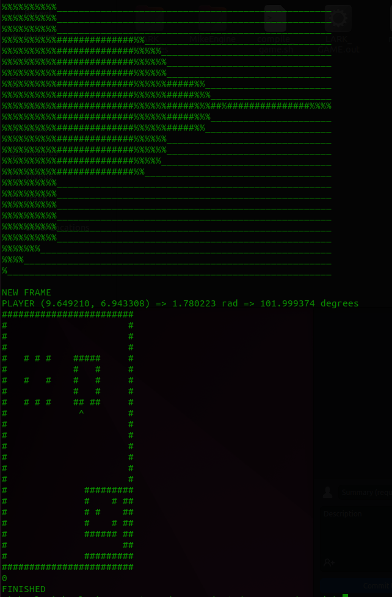

# LARK_Game
L.A.R.K Game for Intro To Unix

10/11/2022
  Got the base raycaster to work (sorta). Used this awesome article (https://lodev.org/cgtutor/raycasting.html) to help. Still gotta do some tweaks

10/10/2022
  Created the base for the engine. The current plan is to make a 2D game that is rendered in a classic DOOM style using raycasting
  Raycast logic should be done, though I have not been able to test due to not having figure out an algorithm to parse the position to screen position and render to ascii graphics.
  It is currently 1:24 AM of 10/11 so I am going to go to bed lol.
